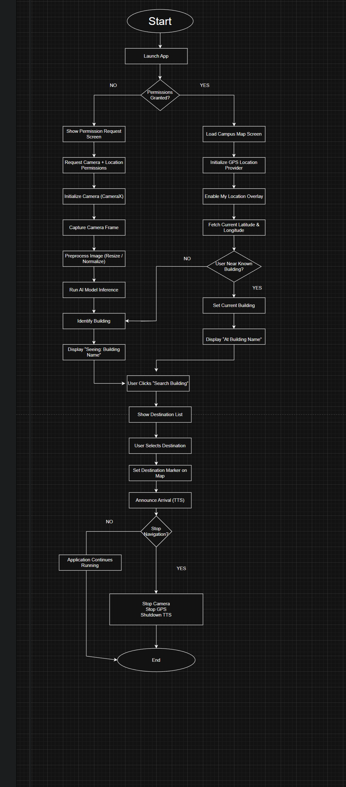

# CampusNavPro

---

## 1. PROJECT OVERVIEW

CampusNavPro is an AI-assisted campus navigation application which is used to help students,teachers,visitors to easily identify their classes,buildings,staff rooms etc and to reach their destinations timely in their college.The system has image recognition with gps based routing to provide real time guidance within a large campus.With the help of the phone camera the users can easily identify their destinations and can reach there timely.The app guides the paths using an interactive map and also provides voice guidance.

The large campuses often have complex layouts with multiple buildings ,hostels,classes so it often becomes tough for a anyone to find their exact location ,newcomers find it difficult to search for their classes and labs ,and even sometimes faculties too find difficulty in finding the staff rooms ,and they often gets confused and end up getting in a wrong location.Signboards and static boards are too outdated and sometimes insufficient also to reach a correct location so this problem is addressed by this project ,the app can recognize campus buildings and can guide users the correct path to their locations.The app has user friendly interface which is very easy for a non technical person to use and also it has very less options so there are less chances of being confused thus it is a pure user friendly app that helps to find their exact locations in the campus without being dependent on others ,its clear user interface makes it look professional which grabs the attention of users and their trust.The app has a image classification model to identify the campus buildings through the device camera and provides correct paths to reach there through gps and voice guidance to reduce continuous screen interaction which is very sufficient for visibly impared users(if any),as in the app everything is predefined so there is no chance of the app leading the user to the wrong path ,so the users can completely trust the app.For the app's fast performance and offline usability we have used Tensorflow lite version 2.14.0,while map rendering and navigation are done using OpenStreetMap data through the OSMDroid library version 6.1.18.

---

## 2. MOTIVATION/PROBLEM STATEMENT

Large companies ,campuses ,universities often have complex layouts with multiple buildings ,blocks,floors,internal pathways so it is difficult for any newcomer to reach to there specific locations on time. For example, in a college if any new student comes he finds it very difficult to reach to his classrooms, labs, Canteen etc .the traditional signboards or static maps are often confusing and are not able to provide the real time guidance.existing navigation solutions such as google maps provides only outer gps navigations ,outside the campus. Inside the campus the gps accuracy becomes too weak and slow ,also the existing apps do not support building level recognization means the user is not able to confirm to eact location or building.

This creates confusion and also our precious time is wasted during this process.So to solve this problem AI and navigation should be combinedly used to get the effective results.AI based image recognization uses the users camera to identify the exact building ,and the navigation system can lead us to the building .The main motive of CampusNavPro is that the users can get the visual confirmation plus the accurate navigation at one place.When we use the on device AI inference then the app provides faster responses and also reduce the internet dependency.also it has voice guidance which allows the hands free navigation which is very helpful for the walking users.This project uses the modern mobile technologies to provide practical ,scalable and user friendly campus navigation solution which effectively addresses the limitations of existing systems.the versions used for different technologies are camera for camera handling version 1.3.1, OSMDroid for map rendering version 6.1.18,tensorflow lite version 2.14.0 and Andriod version 34.

---

## 3. SOLUTION ARCHITECTURE

The solution architecture of CampusNavPro is based on modular and layered design in which every component performs its specific role this makes the system scalable,maintainable and makes its flexible for the future scopes.

The first component is camera plus the AI inference module ,this module uses the phones camera to capture the real time image. Captured image is processed through the device on which the AI model identifies the building or the landmark.When we use the on device inference then the response is faster and the data gets secured under the user data device.

Second important component is the location services module .it uses the module gps and network based location data to detect current position. gps is effective for Outdoor navigation,whereas for campus level positioning it combines with the map data and provides better accuracy.

The third component is the map & routing engine .In this the openstreet map data is used which is rendered through the OSMDroid .the buildings entry points are modeled in the form of graphs ,the routing algorithm calculates the shortest and accessible path which provides efficient navigation to users.

The forth component is the voice assistance module .it converts text based navigations instructions to audio through text-to-speech .due to this feature users can navigate without looking at the screen,which is helpful while walking. Hence overall system follows modular architecture which has AI navigation,UI and voice modulus which are loosely coupled .Versions that are used for these things include - android text-to-speech API android SDK built-in,android SDK version 34.

---

## 4. AI BUILDING RECOGNITION MODULE

The AI building recognition module is based on image classification,whose main purpose is to identify captured buildings images through users camera. this module ensures that users get correct building info and navigation is accurate. Image classification model has been used in this module. The model is specially trained on a custom dataset of campus buildings, which includes images of each building from multiple angles and lighting conditions(mainly daylight). The generalization ability of the model is improved by using data augmentation during training.The model was designed and exported in Teachable Machine, and then converted to TensorFlow Lite (.TFLite) format and deployed on Android devices. 

On-device TFLite inference makes AI processing faster and does not require an internet connection.The input size of the model is fixed (e.g., 224x224 pixels) so that images can be processed efficiently. Model inference is run by extracting frames from camera feed and building class and confidence score is found in the output. If the confidence is below the threshold (here 0.85 is threshold for our project), the system dont shows false information.Confidence thresholds are used to avoid false predictions, especially when the model encounters indoor images or unfamiliar surroundings. This method ensures that the user gets only reliable building recognition information.

**Advantages of it:**
* Real-time on-device recognition
* Offline usage (no internet dependency)
* Fast response for smooth navigation
* Modular design → easily upgrade AI model in future. 

**Version of Tech Stack used:** * CNN (Convolutional Neural Network),MobileNet-based architecture.

**Framework used:** 	•	TensorFlow (browser & cloud-based)
	                    •	Export uses TensorFlow.js

---

## 5. INDOOR/OUTDOOR HANDELING

Differentiation between indoor and outdoor navigation is an important challenge in CampusNavPro. GPS is quite reliable in outdoor environments, and map-based routing provides accurate results. But in any indoor environment the GPS signal may become weak or completely unavailable, which increases the risk of false predictions and wrong navigation guidance, or wrong position updates.The AI-based building recognition module is a closed-set classifier, meaning the model can only recognize buildings that are in its training dataset. If the user is indoors for that scenario, that app is trained under the interiors of classes, and hostels, so that it can recognize interiors.

So for that we include an “Indoor / Other class” notification in the app, in which the model will explicitly recognize whether the user is in an indoor area or outside the building dataset. This will significantly reduce false predictions and guidance errors. Additionally, the possibility of integrating indoor positioning techniques such as Wi-Fi triangulation, BLE beacons or IMU sensor fusion is also being considered, so that the user's indoor location can be accurately tracked, but that thing might be no so accurate.

**Advantages:**
* Protects the user from unreliable indoor predictions
* The combination of confidence threshold and guidance ensures safe navigation.
* Due to modular architecture, advanced indoor positioning can be easily integrated in the future. 

**Version of Tech Stack used:**
* Tensor flow lite version 2.14.0, cameraX version 1.3.1, android SDK version 34, OSMDroid version 6.1.18.

---

## 6. NAVIGATION & MAP SYSTEM

CampusNavPro's navigation system is designed for campus-level paths and buildings. In this, the shortest and accessible route is generated by tracking the user's location, so that the user can easily reach his destination. The system uses graph-based navigation logic which provides accurate and real-time guidance. The app uses OpenStreetMap(OSM) for accessing the maps, and these are formulated through the OSMDroid version 6.1.18 library. This approach is offline-friendly and supports customized layouts of the campus. 

The buildings, roads, entry/exit points and walking paths of the campus are clearly displayed in the app. Campus data is stored in GeoJSON format. It defines the coordinates, pathways and connections of buildings. The advantage of GeoJSON is that it is a structured format, easily parseable, and provides data ready for graph-based algorithms.Campus paths are modeled in the form of nodes (locations) and edges (connections). Navigation algorithm finds the shortest path and gives turn-by-turn guidance to the user. Edge attributes include parameters like distance and accessibility, which are useful in suggesting wheelchair-friendly paths and alternate routes. Haversine formula or Euclidean distance is used for distance calculation, from which accurate walking distance is calculated. This approach ensures that the user reaches the destination in the shortest time. 

**Advantages:**
* Accurate campus-level navigation
* Offline maps support
* Custom paths and accessibility options
* Easily extendable for multi-floor or indoor routing 

**Version of Tech Stack used:**
* OSMDroid version 6.1.18, GeoJSON -standard structured format for paths/buildings, Android SDK version 34, Graphs &Routing Algorithms -custom kotlin implementation.

---

---

##  Application Flowchart

The following flowchart illustrates how the app processes or works of the **Campus Navigation App**, showing how different modules such as permissions, AI-based building recognition, GPS tracking, and navigation interact with each other, and work together.

---

##  Flow Explanation

1.The application starts and initializes the main activity. 
2.Required permissions i.e Camera and Location are checked,and they should be enabled by the user and then further the app continues to navigate. 
3.If permissions are not granted, the user is asked to allow them, through popup. 
4.Once permissions are granted: 
The camera module starts for AI-based building recognition. 
The GPS module starts for real-time location tracking. 
The AI model processes camera frames to identify campus buildings. 
The detected building name is displayed to the user. 
The user can search for a destination building. 
The map updates with navigation markers and routes. 
TTS i.e Text-to-Speech provides voice assistance during navigation from source to destination. 
The application continues tracking until navigation is stopped or the app is closed. 

This flowchart helps in understanding the logical sequence and interaction between AI, GPS, and navigation components of the app.

## 7. VOICE GUIDANCE SYSTEM

The main purpose of voice guidance system in CampusNavPro is to provide hands-free navigation to the users. For walking users or situations where it is difficult to see the screen, audio instructions are user-friendly and efficient solution. The app uses Android Text-to-Speech(TTS) API. This module converts text instructions generated from map and AI modules into audio output in real-time. Jaise: “Turn left at Neelkanth Hostel” or “You have reached the Canteen.”

Importance of Audio Feedback is that Users do not need to continuously look at the map or screen.Navigation during walking or crowded areas appears to be smoothAccessibility is improved, especially for visually impaired users.Repetition control mechanism is implemented in voice instructions. If the user misses a turn or path, the system provides repeat prompts. If the user follows the instructions, unnecessary repetition is avoided. This makes audio feedback non-intrusive and efficient.

---

## Preview

  

**Advantages:**
* Hands-free, real-time guidance
* Better user experience in outdoor & crowded areas
* Modular design → easily integrate multiple languages or advanced voice features
* Works offline with on-device TTS. 

**Version of Tech Stack used:**
* Android text-to-speech API - built-in(android SDK v34), kotlin version 1.9.0(app logic &TTS integration) camera &TensorFlow Lite version 1.3.1.&2.14.0(for stability in older android versions) , OSMDroid version 6.1.18.

---

## 8. USER INTERFACE & INTERACTION

CampusNavPro's User Interface (UI) and interaction design is simple, intuitive and user-friendly, so that users can easily follow campus navigation. The UI and UX modules are based on modular design, allowing future upgrades and customization. Overlay UI is provided on the camera view, in which real-time building recognition and route markers are visible. This tells the user visual confirmation that they are standing in correct building and tell them how to take the next turn.in the overlay Highlighted paths and destination points are also visible overlay which makes navigation smooth.

The App has simple navigation controls, like start, pause, reroute, and manual destination selection. These controls are touch-friendly and responsive, so walking users can operate easily. Multi-floor selection and accessible path toggle can also be included in advanced features. In Map preview module user can zoom, pan and route preview. This feature is especially useful for outdoor navigation and campus planning. Map preview allows the user to visualize an overview of the current location and destination, which helps in decision making. Visual and audio warnings have been integrated into the app. Like if the user is taking a wrong turn or the building recognition confidence is low, the system prompt and alert is given. This mechanism helps the user to ensure safe and accurate navigation. 

**Advantages:**
* Real-time, intuitive visual cues
* Easy-to-use navigation controls
* Map preview for better route planning
* Audio and visual warnings for safe navigation
* Modular UI → future improvements can be easily integrated 

**Version of Tech Stack used:**
* Jetpack Compose version BOM 2023.10.01(for ui design), OSMDroid(version 6.1.18), CameraX(version 1.3.1), TensorFlow Lite(version 2.14.0), Android SDK(version 34).

---

---

## Preview

  

---

## Preview

  

## 9. TECHNOLOGY STACK

CampusNavPro is made with the Android technology. The people who made it picked each tool carefully. They wanted to make sure CampusNavPro has three things: it has to be fast it has to work all the time and it has to perform well. CampusNavPro is, about speed, reliability and performance. The Android app works on Android. It is made for Android SDK 34. It also works on older devices that have Android 7.0. This means the Android app is available, to a lot of people. At the time the Android app can still use the new features of Android. The whole user interface we made is based on Jetpack Compose. Jetpack Compose uses a way of doing things, which makes the user interface easier to work with. The animations in Jetpack Compose feel nicer. It makes it easy to handle the user interface by making it easier to handle for the user. 

The user interface updates are better. The user interface made with Jetpack Compose is easier to manage and fewer errors.so it highly useful. The app is made completely in Kotlin version 1.9.0. Kotlin is a language because it has built in checks to prevent errors when something is empty. This makes the code easy to understand. Kotlin also works well with Compose when it comes to how the apps state changes. For detecting buildings with the help of computers we use a tool called TensorFlow Lite. (version 2.14.0) which helps in making and this tool helps in so that we can figure out what is in them so that we can identify the error and inside things more effectively. This tool helps us look at pictures and figure out what is in them. It does this work right on the device. The TensorFlow Lite Support Library does some tasks to get the pictures ready like making sure the colours are right. It also uses a part of the computer called the GPU to make things go faster when it is looking at the pictures and trying to understand what is, in them. This special part is used when the computer supports it. Navigation and mapping use OpenStreetMap data that is shown through OSMDroid version 6.1.18. This way of doing things is open to everyone. Does not have any problems with licenses. It also lets us make changes to fit the needs of our campus. OpenStreetMap. Osmdroid work together to help with navigation. We use GPS to figure out where we are, in time. For calculating distances OpenStreetMap data and Google Maps utility functions are used together. This technology stack is really good because it makes the app run quickly it is private. The app is flexible so we can make changes to it later on. The technology stack is what makes the app fast and private. This is very important for the technology stack. The technology stack is also flexible which is good, for the technology stack.

---

## 10. PERFORMANCE CONSIDERATIONS

The CampusNavPro system had to work well because it does a lot of things at the same time. It looks at what the camera sees uses intelligence to figure things out tracks where you are with GPS and shows you a live map. So, performance was very important, for CampusNavPro. We made the ai work on the user device using TensorFlow and this help to the user to access the ai without even connected to any network source. It also makes things happen faster. It is safer, for the user’s camera information because it never leaves the user’s phone. The Artificial Intelligence detection happens faster. The user’s privacy is better. 

The camera input is handled by CameraX version 1.3.1. It uses a way of dealing with too much information called STRATEGY_KEEP_ONLY_LATEST. This means the app always looks at the picture it gets from the CameraX and ignores the old ones. This helps prevent the app from slowing down or using much memory. The pictures from the camera are made smaller, to 224×224 pixels. This is the size that the CameraX AI model needs. So, it does not waste time working on pictures that're too big. The CameraX app works with the AI model because of this. The battery usage is very careful managed by us in such a way that it only accesses the gps only when required and in rest of the time it does not use the gps in the background and thus saving the battery by using gps in an intelligent way. The app also tries not to redraw the screen many times when it is not necessary in Jetpack Compose. When you are navigating the app uses the paths instead of figuring them out all over again which means the CPU does not have to work, as hard. The map works better when we fix the zoom levels and do not redraw everything all the time. We only update the route lines when we need to so the map stays fast. Does not reload every second. When you make these choices, your device will work well it will be fast and the battery will last a long time even if you have a mid-range device like the ones that are not too expensive. These choices are good for your devices performance they help with latency and they are also good, for your battery usage.

---

## 11. LIMITATIONS

Despite of being a perfect project, CampusNavPro has some limitations as well. These limitations are important to know about when it comes to CampusNavPro. The biggest problem with this app is that it does not perform best in inside in any building(due to gps inaccuracy) and in dense area, where signals are weak. currently it only focuses on the gps but it can be improved by using more technologies like Bluetooth scanning and WIFI scanning the app also does not use things like sensor fusion to figure out where you are. This means that indoor navigation is just not something that the app can do now. The app relies on GPS, which's not enough, for indoor navigation. Indoor navigation support is really missing from this app. The accuracy of Artificial Intelligence also depends on the lighting. Artificial Intelligence works well when it is daylight outside. When it is dark or there are shadows or it is raining or something is partly, in the way Artificial Intelligence does not work as well. This can make Artificial Intelligence less sure of what it's seeing or it can even make mistakes. 

The training dataset for this thing is really not that big(for a team of 4 members). It has pictures of almost every building in the campus, but not in every conditions. This means the model is not very good at dealing with the campus buildings when they are seen from angles or in different weather. It also has a time with campus buildings when the seasons change. The campus buildings, in the model do not look right when it is snowing or really sunny. The model just does not have campus building pictures to work well in all these different situations.GPS does not work well near trees or tall buildings or if the ground is not flat, but for that we have trained the model to recognize buildings. This means that the distance it shows is not always right and it can give me directions. The GPS drift is really the problem. The GPS drift is what causes these mistakes in how far you have gone and where you need to go. The thing about this app is that it does not work when you are offline. This is because the app needs to be connected to the internet so that it can show the gps tiles, as it requires constant internet connection to display the content of the map. So, if we do not have the internet the map will not be able to load properly so internet is must be there to use the app in a proper way. For a prototype the limitations are okay as there will be scope of improvement so that I can be improved in the final product They really show us what we need to work on to make it better, in the future. The limitations of the prototype are things we can improve on later.

---

## 12.FUTURE SCOPE

The CampusNavPro system is made to be the beginning of something a smart campus that has many different parts working together. CampusNavPro is supposed to be the starting point, for this smart campus ecosystem, the CampusNavPro system. A big improvement that is coming in the future is navigation. This will help the navigation system guide users inside buildings like libraries and hostels and academic blocks. The navigation system will use things like BLE beacons and QR codes and Wi-Fi RTT and sensor fusion to do this. The navigation system will use navigation to help users inside buildings, like libraries and academic blocks. This would be really cool. We should have Augmented Reality navigation. This is where you see arrows and distance markers and building labels on the camera. It would make it easier to find your way. 

Augmented Reality navigation would be a help. You would see everything you need to know right on the screen. The food display we have now could become a system where people can order food from us. This system would let people pick the food they want and put it in a cart. They could then pay for the food online. We would also be able to track the orders using the backend APIs. The food ordering system would make it easy for people to order food from the food display. Future versions of the system could also include things like class schedules and announcements. They could also have emergency alerts and event notifications for the campus. This would be really helpful for people on the campus to know what is going on with the campus services, like class schedules and event notifications. The campus services would be more accessible, to everyone. The people who made this thing want to add something called offline support. This means that maps and routes and the artificial intelligence models will still work when you do not have internet. You will be able to use these things because they will be saved on your device. Finally, expanding and diversifying the AI training dataset would greatly improve recognition accuracy across lighting conditions and seasons.

---

---

## Preview

  

## 13. SETUP & INSTALLATION REQUIREMENT

The CampusNavPro app is made using Android Studio, espaecailly form version like our Android Studio Otter (2025.2.2). The reason why we use this version of android studio is this version of Android Studio supports Jetpack Compose and Kotlin 1.9.0 fully and it is easier that to make and deploy app with this version and in addition to this it works well with Jetpack Compose and Kotlin 1.9.0. as they are the best and finest tools we can use to make our app of Campus Navigation System.

**Requirements:**
* Minimum Android version: Android 7.0 (API 24) 
* RAM: Minimum 3 GB
* Storage: At least 100 MB free space
* Processor: Any modern ARM-based processor

**Required permissions:**
* Camera (AI detection)
* Fine & coarse location (GPS navigation)
* Internet (map tiles)

If the permissions given are not right or if things are not put into correct place, you will get errors executing the program. This is because the program needs to be able to use the things it needs and it needs to be able to find them. If the permissions are not right or if things are not, in the place the program will not be able to do what it is supposed to do and you will get runtime errors with the asset placement and permissions.

---

## 14. USAGE INSTRUCTIONS

When you put CampusNavPro on your device and start it up it will ask if it can use your camera and know where you are. You have to say yes to these things so that CampusNavPro works the way it should. To get a GPS signal users should be outside. When the camera is on if you point your phone at the buildings, on campus the system can find landmarks that it already knows about like the campus buildings. You can pick destinations yourself using the search part of the app. When you do this the app figures out the way to get there and then helps you navigate in real time. It does this by showing you pictures and talking to you with a computer voice. The app uses these things to help you get to your destination. You can stop navigating anytime you want by using the Stop Navigation button. This app is really meant to be used on the campus.

---

## 🔗 Demo Video Link

 **Campus Navigation App – Demo**  
 https://drive.google.com/file/d/14nK8_qPwVPQThgxqrQ3bB2zhRN1ZSt3E/view?usp=drive_link

## 15. HACKATHON CONTEXT

CampusNavPro was made when some people got together for a college competition to create something. During a hackathon we have to work both fast and in an effective way as we have very limited time during a hackathon because in a hackathon, we have to work in a project in just 24-48 hours from understanding the problem to implementing it fully. CampusNavPro is a project that these people worked on during this time.

* **Round 1:** Problem identification, ideation, and solution design
* **Round 2:** for this one we have trained model for building identification inside of the campus live, with your camera, and also it can find path from current location to wherever user wants to go, along with there is a text to audio model, that continously tells how much distance is left, so this can be good for visually impaired students as well.

The team did a great job. They made a working prototype in an amount of time. This prototype uses Artificial Intelligence, navigation and mapping. The Artificial Intelligence and mapping and navigation all work together well.

---

## 16. CREDITS & ACKNOWLEDGEMENTS

The project uses TensorFlow Lite for machine learning that happens on the device and OpenStreetMap for map data that is free and open. The TensorFlow Lite and OpenStreetMap are really useful, for this project. The AI model was trained using Machine, which made it a lot easier to handle the dataset and export the model. This way the project can use TensorFlow Lite and OpenStreetMap to make things work.

---

---

## 📱 Application APK Download

Due to GitHub file size limitations, the APK file is hosted externally.

🔗 **Download Campus Navigation App (APK):**  
 https://drive.google.com/file/d/1cs8-QdxGiaL53qx94cNRlVOeO4Zs-8gX/view?usp=sharing

---

###  Installation Instructions

1. Download the APK from the link above.
2. Enable **Install from Unknown Sources** on your Android device, from your chrome browser.
3. Open the downloaded APK file.
4. Complete the installation and launch the CampusNavpro app.

---

> ⚠️ **Note:**  
> This APK is intended for testing and academic demonstration purposes only.

## 17. LICENSE

CampusNavPro is currently unlicensed and was developed strictly for hackathon evaluation, academic demonstration, and learning purposes. It is not intended for commercial use in its present form. Licensing may be considered if the project evolves further.
